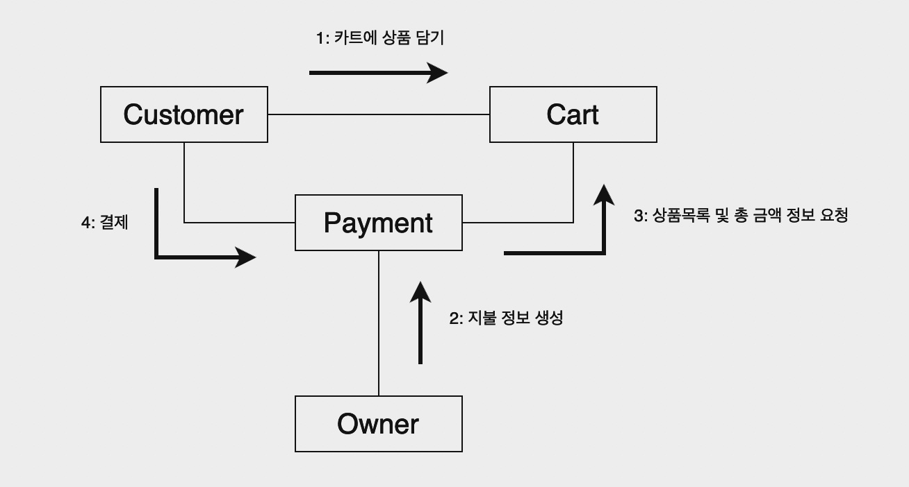

# 1차 과제

 > 마트 계산 시스템을 구성하는 협력을 설계해보세요!

### 마트 계산 시스템

고객이 상품을 카트에 담는다.  
마트오너는 계산하기 전 지불 정보를 만든다.  
고객은 지불 정보를 바탕으로 결제한다. (결제 수단은 오직 카드뿐이다.)

### 가이드  
마트 계산 시스템을 구성하는 메세지는 무엇일까?  
마트 계산 시스템에는 어떤 객체가 필요하고, 각 객체는 어떤 책임을 가져야할까?  
(Hint. 고객, 상품, 카트, 마트오너 + etc)  
어떻게 협력해야할까?
---
## 나의 문제풀이과정
### 메세지
1. 카트 객체에 상품을 담기 `addToCart()`
2. 마트오너는 결제 객체에 지불 정보 생성을 요청 `createPaymentInfo()`
3. 결제 객체는 카트 객체에 상품목록과 총 금액을 요청 `createCartItemInfo()`
4. 고객은 결체 객체에서 생성한 지불 정보를 바탕으로 결제 진행 `pay()`

### 객체와 책임
- Customer (고객)
  1. 상품을 선택하는 책임
  2. 카트가 하는 일을 알고, 요청할 수 있는 책임
  3. 결제 하는 책임
- Item (상품)
  1. 상품 정보를 제공하는 책임
- Cart (카트)
  1. 상품을 카트에 추가하는 책임
  2. 카트에 담긴 상품목록을 관리하는 책임
  3. 카트에 담긴 모든 상품의 총 금액을 계산하는 책임
- Payment (결제)
  1. 지불 정보를 생성하는 책임
  2. 결제 프로세스를 관리하는 책임
  3. 카트가 하는 일을 알고, 요청할 수 있는 책임
- Owner (마트오너)
  1. 결제가 하는 일을 알고, 요청할 수 있는 책임

### 협력


---
## 2차 강의 후 리팩토링

### 1. 결제요청하는 로직과 실제 결제되는 로직 분리
### 문제점 
- 결제요청과 동시에 실제 결제까지 이어지는 하나의 메서드에 두개의 책임을 갖고 있다.
- 고객은 중간에 지불 정보를 확인할 수 없다.
- 결제를 요청하면 중간에 취소할 수 없다.
- 따라서 객체지향원리인 단일책임원칙을 위반한다.
```
  public PaymentResult pay(MartOwner martOwner, Cart cart, PayType payType) {
      PaymentInfo paymentInfo = this.requestCheckOut(martOwner, cart);
      return martOwner.pay(paymentInfo, payType);
    }
```

### 해결방법
- `pay()` 메서드를 두 개의 작업으로 분리
```
    public PaymentResult pay(MartOwner martOwner, PaymentInfo paymentInfo, PayType payType) {
        return martOwner.pay(paymentInfo, payType);
    }

    public PaymentInfo requestCheckOut(MartOwner martOwner, Cart cart) {
        return martOwner.createPaymentInfo(this.id, cart);
    }
```
- 각 메서드가 하나의 작업만 수행하도록 단일책임원칙을 준수함으로써, 고객은 지불 정보를 결제전 미리 확인할 수 있으며, 마트 오너는 추가적인 결제 확인 절차를 요구할 수 있다,
 
### 2. 아이템과 그 수량을 하나의 객체로 관리
### 문제점
- 키와 값을 수동으로 관리해야 하며, 실수로 값을 덮어쓰거나 수량을 올바르게 업데이트하지 못하는 것과 같은 버그가 발생할 가능성이 높아질 수 있다.
- 키와 값이 무엇을 나타내는지 즉시 알 수 없다.
```
public class Cart {

    private HashMap<Item, Integer> itemList;

    public void addCartItem(Item item, int quantity) {
        this.itemList.put(item, itemList.getOrDefault(item, 0) + quantity);
    }
    
    public int calculateTotalPrice() {
        return this.itemList.entrySet().stream().mapToInt(entry ->
                entry.getKey().calculateItemPrice(entry.getValue())).sum();
    }
}
```
### 해결방법
- CartItem 객체를 추가하여 아이템과 수량을 관리한다.
- CartItem 에게 책임을 위임하여 Cart는 CartItem 컬렉션을 관리한다. 
```
public class CartItem {

    private Item item;
    private int quantity;
}

public class Cart {

    private List<CartItem> cartItemList;

    public void addCartItem(CartItem cartItem) {
        this.cartItemList.add(cartItem);
    }
    
    public int calculateTotalPrice() {
        return this.cartItemList.stream().mapToInt(CartItem::calculateCartItemPrice).sum();
    }
}
```
- 책임을 분리함으로써, Cart 의 코드를 단순화시키고, 각 클래스가 자신의 책임에 더 집중할 수 있다.
- 상품 관련 로직이 CartItem 에 집중되어 있기 때문에 새로운 할인정책 로직을 추가할 때 CartItem 클래스를 통해 확장 또는 수정함으로써, 전체적인 시스템 유연성이 증가하였다.


### 3. 리팩토링 후 객체와 책임
- Customer (고객)
  1. 상품을 카트에 추가하는 책임
  2. 마트 오너에게 지불정보 및 결제요청을 하는 책임
- Item (상품)
  1. 상품 정보를 제공하는 책임
  2. 할인 정책을 적용하여 가격을 계산하는 책임
- CartItem (카트 아이템)
  1. 아이템과 수량을 관리하는 책임
- Cart (카트)
  1. 카트아이템을 관리하는 책임
  2. 총 금액을 계산하는 책임
- Payment (결제)
  1. 카트에게 필요한 정보를 요청하는 책임
  2. 지불 정보를 생성하는 책임
  3. 결제 프로세스를 관리하는 책임
- Owner (마트오너)
  1. 결제 객체 관리 책임